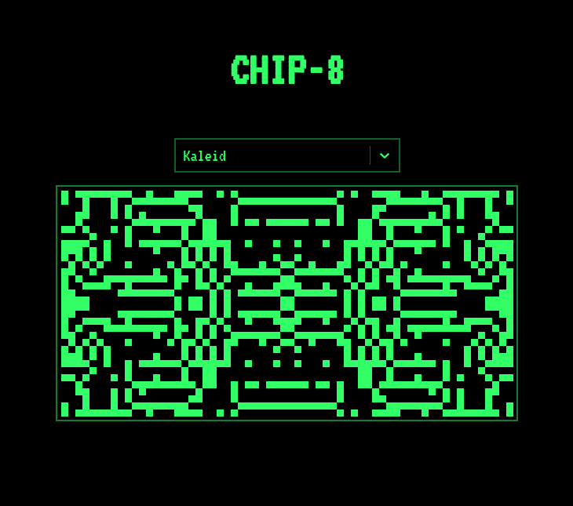

# CHIP-8 WASM

A CHIP-8 frontend made with React + Redux, Rust and WebAssembly



The core of the emulator is available at [sixels/chip8](https://github.com/sixels/chip8)

## Testing online

This project is available online at [sixels.github.io/chip8-wasm](https://sixels.github.io/chip8-wasm). Thanks to GitHub Pages

## Testing locally
You can run it locally by cloning the repository and running
```sh
npm run start
# or
yarn run start
```
Open your browser at [localhost:3000](http://localhost:3000) and enjoy playing some games.
